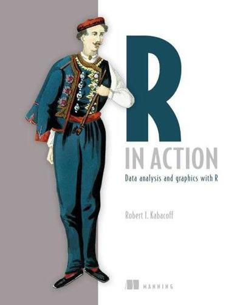
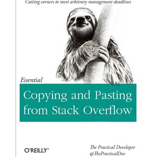

## 簡單自我介紹

- https://yaojenkuo.github.com
- tonykuoyj@gmail.com

## 系統訓練班

- 門禁卡收200元押金
- 今天上完課就得決定是否退費
- 開車的同學記得找講師蓋停車章可以半價優惠
- 加入社團跟同學認識、交流
    - https://www.facebook.com/groups/CSIETrainRL1263/

## 對資料科學的淺見

- 把問題定義清楚
- 找資料(專題一)
- 整理資料(專題一)
- 視覺化探勘(專題二)
- 建模型(專題三)
- 視覺化呈現(專題二)

## 開卷有益

- [R in Action](https://www.manning.com/books/r-in-action-second-edition)



- [The Art of R Programming](http://www.amazon.com/The-Art-Programming-Statistical-Software/dp/1593273843)


## 其他學習管道

- swirl套件
- Coursera
- Data Camp
- R-blogger
- GitHub
- Stackoverflow



## 大眾臉

- 其實R語言長得跟大部分的程式語言蠻像的
- 跟C, C++, Java, VB, C#, Ruby, Python, JavaScript...等語法差不多

## 大眾臉是什麼意思

- if
- for
- while
- function
- ...

## 學R語言的幾個重點

- 安裝**開發環境**
- 如何宣告變數
- 如何寫if
- 如何寫迴圈
- 如何存取不同data type中的元素
- 如何使用function
- 如何宣告function

## 安裝開發環境

- R Console
- RStudio
- https://github.com/yaojenkuo/RGettingStarted/blob/master/R_Installation.md

## 如何宣告變數

- 用`<-`指定
- 或用`=`指定

```{r}
firstVariable <- 'Hello World!'
print(firstVariable)

secondVariable = 2
print(secondVariable)
```

## 如何寫if

```{r}
revenueCalculator <- function(unitCost=50, unit){
    revenue <- unitCost * unit
    if(unit > 100) {
      revenue <- revenue * 0.8
    }
    return(revenue)
}
revenueCalculator(unit=99)
revenueCalculator(unit=101)
```

## 如何寫迴圈

```{r}
vector <- seq(1, 10)
for (index in vector){
  print(index)
}
```

## 如何存取不同data type中的元素

```{r}
vector1 <- seq(1, 9)
vector1[1]

matrix <- matrix(vector1, nrow=3)
matrix[2,3]

vector2 <- seq(10, 18)
dataFrame <- data.frame(vector1, vector2)
dataFrame[, 2]
dataFrame[2, ]
```

## 如何使用function

```{r}
summary(cars)
library(magrittr)
cars %>% summary()
```

## 如何宣告function

```{r}
revenueCalculator <- function(unitCost=50, unit){
    revenue <- unitCost * unit
    if(unit > 100) {
      revenue <- revenue * 0.8
    }
    return(revenue)
}
revenueCalculator(unit=99)
revenueCalculator(unit=101)
```

## 除了語法基本功以外

- R語言的強項是什麼
- R語言可以做哪些事

## R語言強項有

- Free!
- 每隔幾天就有新的套件!
- End-to-end資料分析軟體，什麼都會
- 很多connector
- 在Windows、Mac與Linux平台都可以運作
- 有個很棒的IDE:RStudio

## R語言可以做哪些事

- 蒐集資料
    - 從檔案
    - 從網路
- 整理資料
- 視覺化
- 建模型
- 做Presentation

## 從檔案蒐集資料

```{r}
Sys.setlocale(category = "LC_ALL", locale = "cht")
data <- read.csv("C:/NTUTrainRL1/data/funCoastAccident.csv", stringsAsFactors=FALSE)
colnames(data) <- c("number", "city", "hospital", "gender", "nationality", "age", "medLV1", "medLV2")
head(data, 10)
```

## 從網路蒐集資料

```{r}
# Yahoo Stock Rank Parser
yahooStockRankParser <- function(n){
  if (!n %in% 1:100){
    print("Parameter n should be a number between 1 and 100")
  }else{
    URL <- "https://tw.stock.yahoo.com/d/i/rank.php?t=pri&e=tse&n=100"
    xpathRank <- "//table[2]/tbody/tr/td[1]"
    xpathStock <- "//tbody/tr/td[@class='name']"
    xpathPrice <- "//table[2]/tbody/tr/td[3]"
    doc <- read_html(URL, encoding="cp950")
    rank <- doc %>% 
      html_nodes(.,xpath = xpathRank) %>%
      html_text
    stock <- doc %>% 
      html_nodes(.,xpath = xpathStock) %>%
      html_text %>%
      iconv(from = "UTF-8", to = "UTF-8")
    price <- doc %>% 
      html_nodes(.,xpath = xpathPrice) %>%
      html_text
    stockTmp <- data.frame(rank=as.integer(rank), stock=stock, price=as.numeric(price))# return to local environment
    stockDF <- head(stockTmp, n)
    assign('stockDF',stockDF,envir=.GlobalEnv)
  }
}

# Executing functions
library(magrittr)
library(rvest)
yahooStockRankParser(n=51)
```

## 整理資料

```{r}
str(stockDF)

# Split stock code and name then combine back to original data frame
stockDFSplit <- function(){
  stock <- as.character(stockDF[, "stock"])
  stockCD <- substr(stock, 1, 4)
  stockName <- substr(stock, 6, nchar(stock))
  stockRank <- stockDF[, "rank"]
  stockPrice <- stockDF[, "price"]
  stockDFSplit <<- data.frame(rank=stockRank, name=stockName, price=stockPrice, code=stockCD)
  return(stockDFSplit)
  }
stockDFSplit()
```

## 視覺化

```{r}
library(plotly)
dataComplete <- data[complete.cases(data), ]
ggplot(dataComplete, aes(x=age))+
  geom_histogram(fill="pink", colour="black")+
  facet_grid(medLV2~.)

plot_ly(stockDFSplit, x=name, y=price, type="bar", color=name)

library(leaflet)
helloMap <- leaflet() %>%
  addTiles() %>% #把預設的地圖圖層加入
  addMarkers(lng=121.539366, lat=25.017326, popup="National Taiwan University")
helloMap
```

## 建模型

```{r}
str(cars)
scatterPlot <- plot_ly(cars, x=speed, y=dist, type="scatter", mode="markers", name="data points")
scatterPlot
fit <- lm(cars$dist~cars$speed)
scatterPlot <- add_trace(scatterPlot, y=fitted(fit), name="linear model", mode="lines")
scatterPlot
```

## 做Presentation

- ioslides
- Slidy

## 講義

- [新手上路](https://github.com/yaojenkuo/RGettingStarted)
- [R語言玩資料](https://github.com/yaojenkuo/NTUTrainRL1)